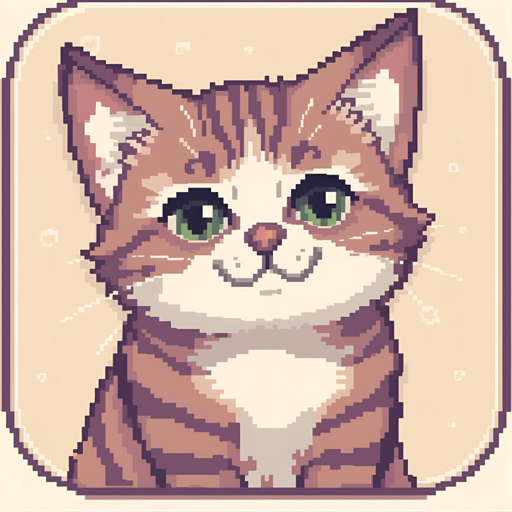

# Title: Cat Rescue

This game was created to teach us how to create HTML pages with CSS styling.  
The game is a multi-HTML paged game where each scene is its own HTML page. 

- GitHub Repository: https://github.com/jtn9701/Web-Apps-HTML-Game
- GitHub Pages: https://jtn9701.github.io/Web-Apps-HTML-Game/

## Pitch
In the game, your cat friend was kidnapped by the villain. 
Your job is to go defeat the villain and save your friend.

## How to Play
- Click "Play" on the landing page.
- Follow the story and find cats to help you along your journey. 
- Click on any wandering cats in the overworld to add them to your party. 

## Features
- Interactive story
- Interactive, clickable components

## Techniques used
- HTML (multi-page), CSS (external stylesheets)
- For the majority of our standard buttons, we decided to use CSS styled anchor tags 
with CSS styling to match the aesthetic of the game. 
- For some of the complex scripts, we abstracted them into their own .js files 
to make the HTML files feel cleaner

## Repo Layout
- `index.html` -- landing & start
- `/game` -- scenes, styles, scripts, assets
- `/docs` -- `flowchart.pdf` and `GameScript.md`

## Credits
### Story
Jason and Johnny 
### Art
AI 
### Music
Octopath Traveller